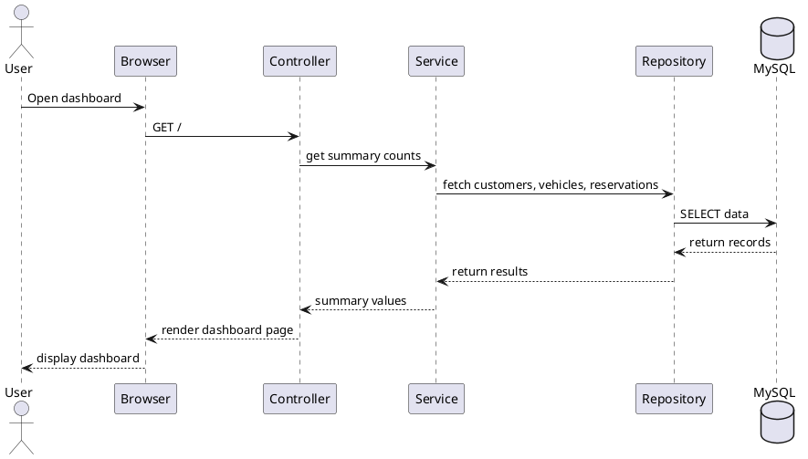
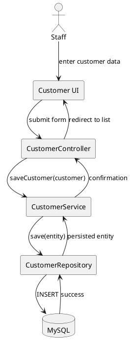
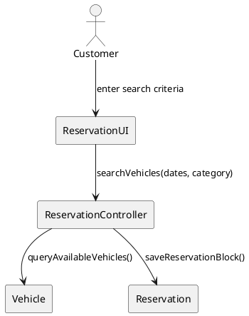

# RentaCar

## 1. Project overview

RentaCar is a Spring Boot MVC application for managing a small to medium-sized car rental business. The project provides a single-platform system for tracking customers, vehicles, reservations, and payments. It is designed for students and developers to learn how a full business workflow can be modeled using Java, Spring Boot, Thymeleaf, JPA, and MySQL.

### Problem and purpose
The business problem is managing rental operations manually across multiple disconnected records. Staff may struggle to keep customer details, vehicle availability, bookings, and payments synchronized. RentaCar addresses this by centralizing the workflow in one application with a structured database and a web interface.

### Scope
The current scope includes:
- customer management
- vehicle inventory management
- reservation creation and status tracking
- payment registration and validation
- dashboard reporting
- persistent data storage using MySQL

### Stakeholders
- Rental business owner or manager
- Front desk staff
- Customers
- Developers and course instructors
- QA/testers

### Features
- Dashboard overview with key counts
- Add, edit, list, and delete customers
- Add, update, list, and track vehicles
- Create reservations with customer and vehicle selection
- Calculate rental totals from daily rate and date range
- Record payments tied to reservations
- Default sample data for demonstration

### Assumptions
- The system is used by a small rental agency.
- A single application instance is sufficient for the business workflow.
- Users access the system via a browser.
- Data persistence is handled through MySQL.

### Constraints
- Web application only; no mobile app or REST API is required in this version.
- Security is basic and not intended for production-grade authentication.
- The system is designed for learning and demonstration rather than large-scale enterprise deployment.
- Java 21 and Spring Boot 3 are required for the current implementation.

---

## 2. Vision document

### Vision statement
To provide a simple, reliable, and user-friendly rental management application that helps staff manage customer records, vehicle availability, reservations, and payments from a single system.

### Business goals
- Reduce manual paperwork and operational errors.
- Improve customer and vehicle management efficiency.
- Provide a clear overview of bookings and payment status.
- Support future extension to reporting, authentication, and more advanced business workflows.

### Success criteria
- Users can create and manage customers in a consistent manner.
- Users can track vehicle availability and maintenance status.
- Reservations can be created with valid customer and vehicle information.
- Payments can be matched to reservations and recorded clearly.
- The system runs reliably in a local development environment.

---

## 3. Software requirements specification (SRS)

### 3.1 Functional requirements
FR-01: The system shall allow users to view a dashboard with business summary counts.
FR-02: The system shall allow users to add, edit, list, and delete customers.
FR-03: The system shall allow users to manage vehicles and update status.
FR-04: The system shall allow users to create reservations for a customer and vehicle.
FR-05: The system shall calculate total price using vehicle daily rate and reservation duration.
FR-06: The system shall allow users to record payments associated with reservations.
FR-07: The system shall persist all records in a database.
FR-08: The system shall load default sample data automatically when the database is empty.

### 3.2 Nonfunctional requirements
NFR-01: The application shall run on Java 21.
NFR-02: The application shall use Spring Boot 3.2.x.
NFR-03: The application shall persist data in MySQL 8.
NFR-04: The web interface shall be accessible through a browser at localhost:8080.
NFR-05: The application shall be easy to run in a local developer environment.
NFR-06: The system shall keep business logic separated into reusable service classes.

### 3.3 Use cases
UC-01: View dashboard
UC-02: Add customer
UC-03: Update customer
UC-04: Delete customer
UC-05: Add vehicle
UC-06: Update vehicle status
UC-07: Create reservation
UC-08: Delete reservation
UC-09: Record payment

### 3.4 Use-case descriptions

#### UC-01: View dashboard
Actor: Staff member
Precondition: The application is running.
Flow: The staff member opens the application home page and sees summary counts for customers, vehicles, and reservations.
Postcondition: The dashboard displays the current system status.

#### UC-02: Add customer
Actor: Staff member
Precondition: Staff has access to the customer page.
Flow: Staff enters name, email, phone, license number, and address, then saves the record.
Postcondition: A new customer record is stored in the database.

#### UC-07: Create reservation
Actor: Staff member
Precondition: At least one customer and one vehicle exist.
Flow: Staff chooses a customer, selects a vehicle, enters dates, and saves the reservation.
Postcondition: A reservation record is created and linked to the customer and vehicle.

---

## 4. System architecture

RentaCar follows a three-tier, monolithic Spring MVC architecture:

- Presentation layer: Thymeleaf templates and HTML views
- Application layer: controllers and service classes
- Data layer: JPA repositories and MySQL database

### Architectural components
- `controller`: handles user requests and page routing
- `service`: contains business logic and validation
- `repository`: provides database access through Spring Data JPA
- `model`: entity classes that map to database tables
- `templates`: UI pages for dashboard and forms
- `resources`: application configuration and static styles

### Database model
The application stores entities such as:
- `Customer`
- `Vehicle`
- `Reservation`
- `Payment`
- `Student` and `User` exist in the project as additional entity examples but are not central to the car rental workflow.

---

## 5. Diagrams

### 5.1 Sequence diagram


### 5.2 Collaboration diagram


### 5.3 VOPC diagram


---

## 6. Technology stack

- Java 21
- Spring Boot 3.2.11
- Spring Web MVC
- Spring Data JPA
- Thymeleaf
- Maven
- MySQL 8
- Hibernate ORM
- JUnit 5
- Mockito
- Docker (for local MySQL container)

---

## 7. Application-layer structure

```text
src/main/java/com/example/rentacar/
├── RentaCarApplication.java
├── DataSeeder.java
├── controller/
│   ├── HomeController.java
│   ├── CustomerController.java
│   ├── VehicleController.java
│   ├── ReservationController.java
│   ├── PaymentController.java
│   └── StudentController.java
├── service/
│   ├── CustomerService.java
│   ├── VehicleService.java
│   ├── ReservationService.java
│   ├── PaymentService.java
│   └── StudentService.java
├── repository/
│   ├── CustomerRepository.java
│   ├── VehicleRepository.java
│   ├── ReservationRepository.java
│   ├── PaymentRepository.java
│   ├── StudentRepository.java
│   └── UserRepository.java
├── model/
│   ├── Customer.java
│   ├── Vehicle.java
│   ├── Reservation.java
│   ├── Payment.java
│   ├── Student.java
│   └── User.java
├── dto/
└── ...
```

### Responsibilities
- `controller`: page-level request handling
- `service`: business rules and coordination
- `repository`: database CRUD operations
- `model`: domain entity mappings
- `DataSeeder`: loads sample data when database is empty

---

## 8. Installation, configuration, and execution

### Prerequisites
- Java 21
- Maven
- Docker Desktop or Docker Engine
- MySQL 8 via Docker container or a local MySQL instance

### 1) Clone the repository
```bash
git clone <repository-url>
cd prj/RentaCar
```

### 2) Start MySQL with Docker
```bash
docker run --name rentacar-mysql \
  -e MYSQL_DATABASE=rentacar \
  -e MYSQL_USER=rentacar_user \
  -e MYSQL_PASSWORD=<your_mysql_password> \
  -e MYSQL_ROOT_PASSWORD=<your_root_password> \
  -p 3306:3306 \
  -d mysql:8.0
```

> Use your own local values for these environment variables. Do not commit actual credentials to the repository.

### 3) Set Java environment
```bash
export JAVA_HOME=/usr/local/opt/openjdk@21/libexec/openjdk.jdk/Contents/Home
export PATH="$JAVA_HOME/bin:$PATH"
```

### 4) Configure the application
Update environment variables before running the app:

```bash
export SPRING_DATASOURCE_URL='jdbc:mysql://localhost:3306/rentacar?createDatabaseIfNotExist=true&useSSL=false&allowPublicKeyRetrieval=true&serverTimezone=UTC'
export SPRING_DATASOURCE_USERNAME='rentacar_user'
export SPRING_DATASOURCE_PASSWORD='<your_mysql_password>'
```

The project configuration is defined in `src/main/resources/application.properties` as:

```properties
spring.datasource.url=${SPRING_DATASOURCE_URL:jdbc:mysql://localhost:3306/rentacar?createDatabaseIfNotExist=true&useSSL=false&allowPublicKeyRetrieval=true&serverTimezone=UTC}
spring.datasource.username=${SPRING_DATASOURCE_USERNAME:rentacar_user}
spring.datasource.password=${SPRING_DATASOURCE_PASSWORD:change_me}
```

### 5) Run the application
```bash
mvn spring-boot:run
```

### 6) Open the app
```text
http://localhost:8080/
```

---

## 9. Database setup instructions

The application uses MySQL as the persistence layer. A local database can be created with Docker as shown above.

### Database connection values
Use your own local values for:
- host: `localhost`
- port: `3306`
- database: `rentacar`
- username: `rentacar_user`
- password: `<your_mysql_password>`

Do not store actual database credentials in the repository or in version-controlled configuration files.

### Recommended database creation steps
```bash
docker exec -it rentacar-mysql mysql -uroot -p
CREATE DATABASE rentacar;
CREATE USER 'rentacar_user'@'%' IDENTIFIED BY '<your_mysql_password>';
GRANT ALL PRIVILEGES ON rentacar.* TO 'rentacar_user'@'%';
FLUSH PRIVILEGES;
```

The application will create tables automatically through Hibernate using `spring.jpa.hibernate.ddl-auto=update`.

---

## 10. Automated tests and evidence

The project includes automated tests under `src/test/java/com/example/rentacar`.

### Test commands
```bash
export JAVA_HOME=/usr/local/opt/openjdk@21/libexec/openjdk.jdk/Contents/Home
export PATH="$JAVA_HOME/bin:$PATH"
mvn test
```

### Fresh verification evidence
The project was verified in the local environment using Java 21 and a live MySQL container. The test suite was executed successfully with:

```bash
export JAVA_HOME=/usr/local/opt/openjdk@21/libexec/openjdk.jdk/Contents/Home
export PATH="$JAVA_HOME/bin:$PATH"
cd /Users/uyenhoang/Documents/MIU/SE/src/CS425SE/prj/RentaCar
mvn test -q
```

This run completed successfully after the MySQL database was reachable on port 3306, and the project started with Spring Boot context initialization and repository tests running correctly.

---

## 11. Screenshots and sample outputs

Sample application screenshots are stored in the `screenshots/` folder:

- `home.png`
- `customers-list.png`
- `vehicles-list.png`
- `reservations-list.png`
- `customer-form.png`

A typical user flow shows:
1. landing dashboard with counts
2. customer list view
3. vehicle list view
4. reservation list view
5. payment record display

---

## 12. Known limitations and future improvements

### Known limitations
- The app is a monolithic web application, not a distributed or microservice architecture.
- Basic UI and validation are sufficient for a learning project but not production-grade.
- Authentication and authorization are not implemented yet.
- The system does not include advanced reporting, filtering, or multi-user administration.
- Payment processing is simulated at the application logic level rather than integrated with a real payment provider.

### Possible future improvements
- Add role-based access control for staff and administrators.
- Add search, sorting, and filtering across customers, vehicles, and reservations.
- Add reporting and analytics dashboard views.
- Add email and SMS notification support.
- Add REST API endpoints for external clients.
- Integrate a real payment gateway.
- Add deployment support for cloud hosting and production database configuration.

---

## 13. Summary

RentaCar is a practical Java/Spring Boot rental management application that demonstrates how a business workflow can be implemented using a layered architecture, persistent storage, a browser-based UI, and automated tests. It is suitable for learning, coursework, and extension into a larger business system.

No live passwords, API keys, or database credentials are stored in the repository. All sensitive values should be supplied through environment variables at runtime.
